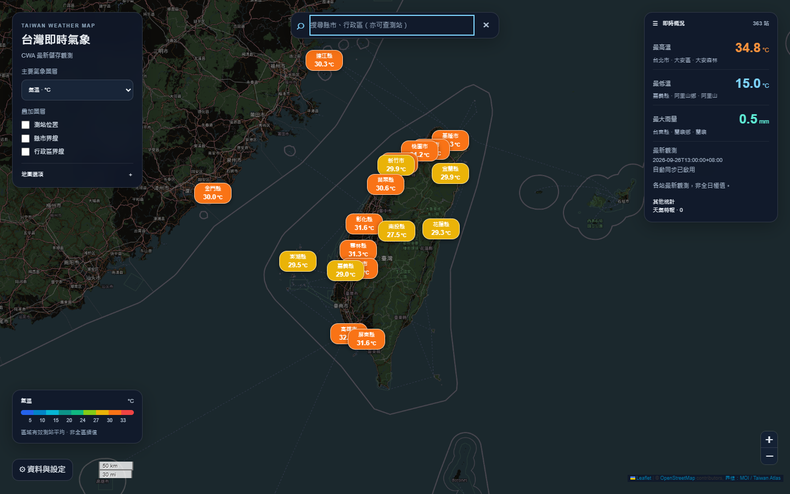
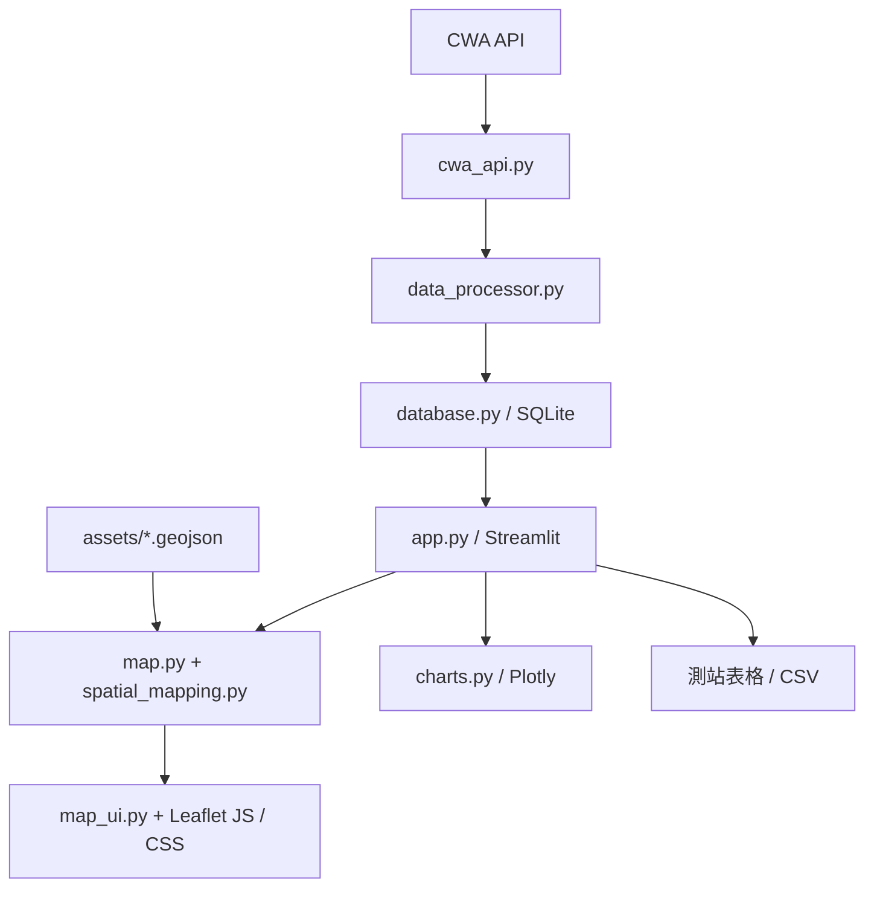

# 台灣即時氣象地圖 · Taiwan Weather Dashboard

以地圖為主的 Streamlit 氣象應用，串接中央氣象署（CWA）、SQLite 與 Folium / Leaflet，呈現測站觀測、縣市與行政區平均值，並提供預報趨勢及 CSV 匯出。



## 功能與資料解讀

- 切換氣溫、濕度、雨量、風速；只有包含有效觀測的圖層可選。
- 獨立開關測站位置、縣市界線與行政區界線。
- 縮放層級 ≤ 8 顯示縣市，> 8 顯示行政區；放大後仍以行政區平均值為主。
- 搜尋縣市、行政區、測站名稱或代碼，支援「台／臺」正規化及鍵盤操作。
- 點選區域可查看各指標有效站數，以及來源測站的原始讀數與觀測時間。
- 地圖概況提供氣溫極值、最大雨量、最新觀測時間與警報狀態。
- 「資料與設定」提供 API Key、自動／手動同步、測站表格、CSV 與 Plotly 預報趨勢。

各指標分別忽略缺測值，計算有效測站的算術平均。**雨量也是測站平均，不是區域總雨量或空間插值**。缺測不轉成 0；真實的 0 會保留。沒有觀測時顯示空地圖，仍可搜尋行政界線；目前沒有示範資料按鈕。

## 安裝與啟動

需要 Python 3.10+，請在專案根目錄執行。CI 設定驗證 Python 3.10 與 3.12。

### Windows PowerShell

```powershell
python -m venv .venv
.\.venv\Scripts\python.exe -m pip install -r requirements.txt
Copy-Item .env.example .env
# 編輯 .env，填入自己的 CWA_API_KEY
.\.venv\Scripts\python.exe -m streamlit run app.py
```

### macOS / Linux

```bash
python3 -m venv .venv
.venv/bin/python -m pip install -r requirements.txt
cp .env.example .env
# 編輯 .env，填入自己的 CWA_API_KEY
.venv/bin/python -m streamlit run app.py
```

開啟 `http://localhost:8501`。入口是 `app.py`；`map.py` 是地圖模組。

### 環境設定

從 [CWA 開放資料平台](https://opendata.cwa.gov.tw/) 取得授權碼，在 `.env` 設定：

```dotenv
CWA_API_KEY=your_cwa_api_key_here
CWA_DATASET_ID=F-C0032-001
DB_PATH=data/data.db
```

也可以在「資料與設定」輸入 API Key，點選「立即同步 CWA」。有效金鑰存在時，初次開啟會嘗試同步；自動更新預設每 10 分鐘，可於設定調整。自動更新只在應用程式工作階段運行時進行，並非背景排程服務。

`CWA_DATASET_ID` 是 API 函式未指定資料集時的預設值；目前應用程式同步明確指定以下三個資料集：

| 用途 | 資料集 |
| --- | --- |
| 測站觀測 | `O-A0003-001` |
| 36 小時天氣預報 | `F-C0032-001` |
| 天氣警特報 | `W-C0033-002` |

以上對應專案目前的 API 呼叫設定。預報或警報取得失敗時，觀測同步仍可能成功；警報未取得與零警報分開呈現，預報可能保留舊資料。

`.env` 與 SQLite 資料庫已列入 `.gitignore`，請勿提交真實金鑰。未設定金鑰時，可查看既有資料庫；全新安裝則顯示空地圖。

## 架構與開發流程



| 路徑 | 職責 |
| --- | --- |
| `app.py` | 應用程式入口、同步流程、設定對話框 |
| `cwa_api.py` | API 授權、逾時與連線重試 |
| `data_processor.py` | 觀測、預報、警報解析與缺測處理 |
| `database.py` | SQLite 建表、參數化查詢、Upsert |
| `map.py` | 地圖產生、觀測聚合與前端 payload |
| `spatial_mapping.py` | 依座標判定行政區，處理邊界與 fallback |
| `map_ui.py` | 地圖控制介面與樣式整合 |
| `assets/weather-renderer.js` | 縮放、地圖標籤、區域著色 |
| `assets/weather-map.js` / `.css` | 搜尋、圖層控制與地圖樣式 |
| `assets/*.geojson` | 本地縣市及鄉鎮市區界線 |
| `charts.py` | 預報氣溫圖表 |
| `tests/` | 單元測試與手動瀏覽器回歸腳本 |
| `.github/workflows/ci.yml` | GitHub Actions 自動檢查 |
| `mapc.py` | 舊版備份，目前應用程式未使用 |

SQLite 預設儲存在 `data/data.db`，啟動時自動建表：

- `TemperatureForecasts`：以 `(regionName, dataDate)` 唯一識別，重複寫入更新預報。
- `StationObservations`：以 `stationId` 為主鍵，儲存每站最新讀數；不是歷史觀測快照。

修改後先執行單元測試；若涉及地圖互動，再執行瀏覽器回歸檢查。提交至 GitHub 後，由 CI 執行同一套單元測試與前端語法檢查。

## 測試

以下命令使用已安裝專案依賴的 Python；Windows 可將 `python` 換成 `.\.venv\Scripts\python.exe`。

```bash
python -m pytest tests/ -q
```

測試涵蓋 API mock、預報解析、SQLite Upsert、缺測與真零、地圖 payload、行政區座標判定及來源追蹤。單元測試不需要真實 CWA 金鑰。

若已安裝 Node.js，可檢查前端 JavaScript 語法：

```bash
node --check assets/weather-map.js
node --check assets/weather-renderer.js
```

### 瀏覽器回歸（手動）

現有腳本限定 Windows 專案內的 `.venv` 與已安裝的 Microsoft Edge，另外安裝開發用 Playwright：

```powershell
.\.venv\Scripts\python.exe -m pip install playwright
.\.venv\Scripts\python.exe tests/browser_map_ui.py --empty
.\.venv\Scripts\python.exe tests/browser_map_ui.py
```

`--empty` 隔離空資料情境，不呼叫 CWA 或存取正式資料庫。未加參數的版本需要有效 CWA 金鑰，會同步並更新設定的 SQLite 資料庫，驗證多種螢幕尺寸、圖層、搜尋、popup、CSV 與預報。兩者的地圖前端都需要網路載入外部資源。

### GitHub Actions workflow

[CI workflow](.github/workflows/ci.yml) 在 push、pull request 與手動觸發時執行：

1. Ubuntu 上以 Python 3.10、3.12 安裝 `requirements.txt` 並執行 `python -m pytest tests/ -q`。
2. 使用 Node.js 22 檢查兩個地圖 JavaScript 檔案的語法。

Workflow 使用唯讀 repository 權限與 pip 快取，不需設定 GitHub Secrets。同一分支的新執行會取消舊執行。瀏覽器回歸另行手動執行；此 workflow 不部署網站，也不排程抓取氣象資料。

Action 設定可參考官方 [setup-python](https://github.com/actions/setup-python) 與 [setup-node](https://github.com/actions/setup-node) 文件。

## 圖資與限制

界線使用附帶的 Taiwan Atlas 2021.9.20 參考圖資，涵蓋 22 縣市及 368 鄉鎮市區，不是即時行政區更新服務。來源與授權見 [assets/BOUNDARIES.md](assets/BOUNDARIES.md) 及 [授權檔](assets/taiwan-atlas-LICENSE.txt)。

行政區歸屬優先使用座標與 Polygon / MultiPolygon 判定；無法直接定位時，只採用可確認的 CWA 行政區欄位，不以最近距離猜測。未能確認的站不加入行政區平均。詳細規則與 UI 說明見 [UI_NOTES.md](UI_NOTES.md)。

Leaflet 與 OpenStreetMap 圖磚需要網路。沒有歷史觀測快照，因此不提供歷史／未來日期觀測圖層；預報趨勢位於設定對話框。

## 常見問題

- **沒有觀測或圖層選項**：確認金鑰後執行「立即同步 CWA」，並查看同步錯誤；不會產生虛構資料補齊。
- **HTTP 401 / 403**：確認 CWA 授權碼與存取權限。
- **預報空白或未更新**：預報獨立抓取，觀測成功不代表預報成功；稍後重新同步。
- **底圖空白**：檢查外部 Leaflet 資源及 OSM 圖磚是否被網路阻擋。
- **資料庫無法寫入**：確認 `DB_PATH` 的目錄可寫入，並從專案根目錄啟動。
